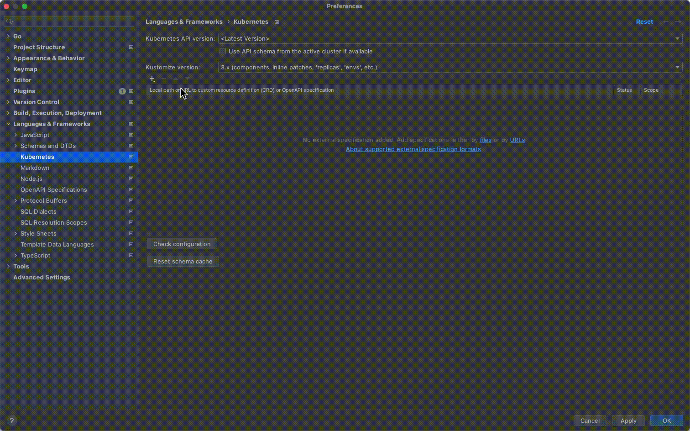

# Tyk Operator

[](https://goreportcard.com/report/github.com/TykTechnologies/tyk-operator)

<p>
<a href="https://github.com/TykTechnologies/tyk" target="_blank">
Tyk Gateway</a> is a modern, ultra-performant, purpose-built, and open source API
Gateway.
</p>
<p>
Tyk Operator brings Full Lifecycle API Management capabilities to Kubernetes.
You can configure Ingress, APIs, Security Policies, Authentication, Authorization, Mediation by using GitOps best
practices with Custom Resources and Kubernetes-native primitives.
</p>
<p align="center">
  
</p>

---

[Project Status](#project-status) | [Introduction](#introduction) | [Documentation](#documentation) | [Learning with Videos](#learning-with-videos) | [Quickstart Examples](#quickstart-examples) | [IDE Integration](#ide-integration) | [Community](#community)

---

## Project Status
Tyk Operator is currently in beta. We follow the [Kubernetes definition of beta](https://kubernetes.io/docs/reference/command-line-tools-reference/feature-gates/#feature-stages). We welcome users to try it out and give us feedback [here](https://github.com/TykTechnologies/tyk-operator/discussions) or via support channel for existing Tyk customers.


## Introduction

### What can you do with Tyk Operator?

Tyk Operator can configure Tyk Gateway as a drop-in replacement for standard [Kubernetes Ingress](./docs/ingress.md). You can manage your API definitions and security policies with it. It also works with the Classic Portal so you can manage your Classic Portal declaratively.

Custom Tyk Objects are available as [CRDs](https://kubernetes.io/docs/concepts/extend-kubernetes/api-extension/custom-resources/) and documentation for each of these custom resources are available [here](#documentation).

### Tyk Licensing
Tyk Operator and Tyk Gateway are both 100% Open Source. Tyk Operator will operate on a single gateway.

Feel free to reach to our commercial team (or your account manager for existing customers) if you need advice about architecture, licensing, or just to discuss your requirements for runnning in HA, scaling across clusters, nodes & namespaces.

### What benefits Tyk Operator has?

You can get the benefits of GitOps with declarative API configurations:

- **Security and Compliance**: All changes must go through peer review through pull requests. The configurations are versioned in your version control system and approved by your API Product Owner and Platform team.

- **Kubernetes-Native Developer Experience**: API Developers enjoy a smoother Continuous Integration process as they can develop, test, and deploy the microservices and API configurations together using familiar development toolings and pipeline.

- **Reliability**: With declarative API configurations, you have a single source of truth to recover after any system failures, reducing the meantime to recovery from hours to minutes.


## Documentation

Read more from our [Official doc site](https://tyk.io/docs/tyk-operator/).

- [Installing Tyk Operator](https://tyk.io/docs/tyk-stack/tyk-operator/installing-tyk-operator/)
- [Getting Started](https://tyk.io/docs/tyk-stack/tyk-operator/getting-started-tyk-operator/)
- [Migration to Tyk Operator](https://tyk.io/docs/tyk-stack/tyk-operator/migration/)
- [Using Tyk Operator to enable GitOps with Tyk](https://tyk.io/docs/getting-started/key-concepts/gitops-with-tyk/)

Learn about our CRDs:

- [Ingress Controller](./docs/ingress.md)
- [API Definitions](./docs/api_definitions.md)
- [Security Policies](./docs/policies.md)
- [Multi Gateway with Operator Context](./docs/operator_context.md)

## Learning with Videos

- [GitOps Friendly API Management with Tyk Operator](https://youtu.be/AaDnBMrS-2c)
- [Extending Kubernetes Ingress with Tyk Operator](https://youtu.be/jq1a_7bo78w)
- [Declarative REST to GraphQL with Tyk Kubernetes Operator and Universal Data Graph](https://youtu.be/NYzIh8yCJ7M)
- [Configuring VS Code Tyk Custom Resources Intellisense](https://youtu.be/Kdrfp6aAZEU)

## Quickstart Examples

<details><summary>HTTP Proxy</summary>
<p>

```yaml
apiVersion: tyk.tyk.io/v1alpha1
kind: ApiDefinition
metadata:
  name: httpbin
spec:
  name: httpbin
  do_not_track: false
  use_keyless: true
  protocol: http
  active: true
  org_id: acme.com
  proxy:
    target_url: http://httpbin.org
    listen_path: /httpbin
    strip_listen_path: true
```

</p>
</details>

<details><summary>TCP Proxy</summary>
<p>

```yaml
apiVersion: tyk.tyk.io/v1alpha1
kind: ApiDefinition
metadata:
  name: redis-tcp
spec:
  name: redis-tcp
  active: true
  protocol: tcp
  listen_port: 6380
  proxy:
    target_url: tcp://localhost:6379
```

</p>
</details>

<details><summary>GraphQL Proxy</summary>
<p>

```yaml
apiVersion: tyk.tyk.io/v1alpha1
kind: ApiDefinition
metadata:
  name: trevorblades
spec:
  name: trevorblades
  use_keyless: true
  protocol: http
  active: true
  proxy:
    target_url: https://countries.trevorblades.com
    listen_path: /trevorblades
    strip_listen_path: true
  graphql:
    enabled: true
    execution_mode: proxyOnly
    schema: |
      directive @cacheControl(maxAge: Int, scope: CacheControlScope) on FIELD_DEFINITION | OBJECT | INTERFACE

      enum CacheControlScope {
        PUBLIC
        PRIVATE
      }

      type Continent {
        code: ID!
        name: String!
        countries: [Country!]!
      }

      input ContinentFilterInput {
        code: StringQueryOperatorInput
      }

      type Country {
        code: ID!
        name: String!
        native: String!
        phone: String!
        continent: Continent!
        capital: String
        currency: String
        languages: [Language!]!
        emoji: String!
        emojiU: String!
        states: [State!]!
      }

      input CountryFilterInput {
        code: StringQueryOperatorInput
        currency: StringQueryOperatorInput
        continent: StringQueryOperatorInput
      }

      type Language {
        code: ID!
        name: String
        native: String
        rtl: Boolean!
      }

      input LanguageFilterInput {
        code: StringQueryOperatorInput
      }

      type Query {
        continents(filter: ContinentFilterInput): [Continent!]!
        continent(code: ID!): Continent
        countries(filter: CountryFilterInput): [Country!]!
        country(code: ID!): Country
        languages(filter: LanguageFilterInput): [Language!]!
        language(code: ID!): Language
      }

      type State {
        code: String
        name: String!
        country: Country!
      }

      input StringQueryOperatorInput {
        eq: String
        ne: String
        in: [String]
        nin: [String]
        regex: String
        glob: String
      }

      """The `Upload` scalar type represents a file upload."""
      scalar Upload
    playground:
      enabled: true
      path: /playground
```

</p>
</details>

<details><summary>Universal Data Graph - Stitching REST with GraphQL</summary>
<p>

```yaml
apiVersion: tyk.tyk.io/v1alpha1
kind: ApiDefinition
metadata:
  name: udg
spec:
  name: Universal Data Graph Example
  use_keyless: true
  protocol: http
  active: true
  proxy:
    target_url: ""
    listen_path: /udg
    strip_listen_path: true
  graphql:
    enabled: true
    execution_mode: executionEngine
    schema: |
      type Country {
        name: String
        code: String
        restCountry: RestCountry
      }

      type Query {
        countries: [Country]
      }

      type RestCountry {
        altSpellings: [String]
        subregion: String
        population: String
      }
    type_field_configurations:
      - type_name: Query
        field_name: countries
        mapping:
          disabled: false
          path: countries
        data_source:
          kind: GraphQLDataSource
          data_source_config:
            url: "https://countries.trevorblades.com"
            method: POST
            status_code_type_name_mappings: []
      - type_name: Country
        field_name: restCountry
        mapping:
          disabled: true
          path: ""
        data_source:
          kind: HTTPJSONDataSource
          data_source_config:
            url: "https://restcountries.com/v2/alpha/{{ .object.code }}"
            method: GET
            default_type_name: RestCountry
            status_code_type_name_mappings:
              - status_code: 200
    playground:
      enabled: true
      path: /playground
```

</p>
</details>

## IDE Integration

API developers may add K8s extensions to popular IDEs to enjoy auto-completion while editing Tyk CRD YAML files. Here's the detail steps.

### VS Code

[Watch video tutorial here](http://www.youtube.com/watch?v=Kdrfp6aAZEU).

<details><summary>Steps</summary>

1. Go to the following link: <https://marketplace.visualstudio.com/items?itemName=ms-kubernetes-tools.vscode-kubernetes-tools>
2. Click on Install. This will prompt you to open Visual Studios.
3. Click Open Visual Studios at the subsequent prompt. This will open VS Code and take you to the Extensions' section.
4. Click Install in the Kubernetes extension page.

Note: The extension should take effect immediately. In case it doesn't, simply restart VS Code.

</details>

### GoLand

<details><summary>Steps</summary>

1. Open `Plugins` settings following official GoLand documentation <https://www.jetbrains.com/help/go/managing-plugins.html>
2. Install `Kubernetes` plugin (<https://plugins.jetbrains.com/plugin/10485-kubernetes>)
3. Open GoLand `Preferences` as described [here](https://www.jetbrains.com/help/go/settings-preferences-dialog.html),
4. Go to `Languages & Frameworks > Kubernetes`
5. Click `Add URLs` and add `https://raw.githubusercontent.com/TykTechnologies/tyk-operator/{version_tag}/helm/crds/crds.yaml`,
   1. For example, if you would like to use CRDs of `v0.9.0`, replace `{version_tag}` with `v0.9.0` and add <https://raw.githubusercontent.com/TykTechnologies/tyk-operator/v0.9.0/helm/crds/crds.yaml>
   2. Please add CRDs of `master` for latest CRDs, as follows <https://raw.githubusercontent.com/TykTechnologies/tyk-operator/master/helm/crds/crds.yaml>

6. Apply and save changes.

</details>

## Community

Tyk Operator is under active development.

We are building the operator to enable you to build and ship your APIs faster and more safely.

If you find any defects, please [raise an issue](https://github.com/TykTechnologies/tyk-operator/issues/new). We welcome code contributions as well.

If you require any features that we have not yet implemented, please take your time to [create a GitHub issue](https://github.com/TykTechnologies/tyk-operator/issues/new/choose) detailing your use case so that we may prioritise accordingly.

For larger and more in-depth feature requests, please consider [starting an RFC thread](https://github.com/TykTechnologies/tyk-operator/discussions/new) in the [Discussions area](https://github.com/TykTechnologies/tyk-operator/discussions).

- [Configuring your development environment](./docs/development.md)
- [Request a feature](https://github.com/TykTechnologies/tyk-operator/issues)
- [Got an Idea or RFC](https://github.com/TykTechnologies/tyk-operator/discussions/categories/ideas)
- [Found a Defect](https://github.com/TykTechnologies/tyk-operator/issues)
- [Got a Question](https://github.com/TykTechnologies/tyk-operator/discussions/categories/q-a)
- [Show and Tell](https://github.com/TykTechnologies/tyk-operator/discussions/categories/show-and-tell)
