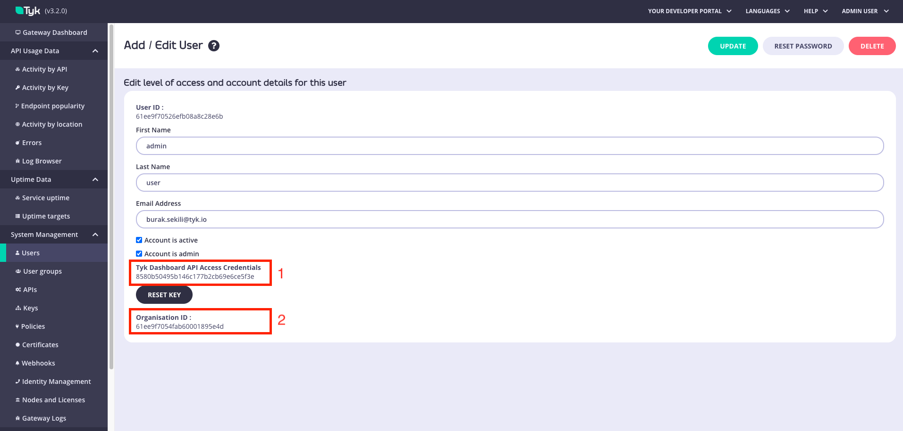

# Tyk Operator Installation

- [Prerequisites](#prerequisites)
- [Tyk Licensing](#tyk-licensing)
- [Installing Tyk](#installing-tyk)
- [Tyk Operator Configuration](#tyk-operator-configuration)
  - [Connecting Tyk Operator to Tyk Gateway](#connecting-tyk-operator-to-tyk-gateway)
    - [Tyk Pro](#tyk-pro)
    - [Tyk CE](#tyk-ce)
  - [Watching Namespaces](#watching-namespaces)
  - [Watching custom ingress class](#watching-custom-ingress-class)
  - [Installing cert-manager](#installing-cert-manager)
- [Installing CRDs](#installing-crds)
- [Installing Tyk Operator](#installing-tyk-operator)
- [Upgrading Tyk Operator](#upgrading-tyk-operator)
- [Uninstall](#uninstall)

## Prerequisites

Before running the operator

- A fully functioning & bootstrapped Tyk installation (CE or Pro Licensed) needs to be installed and accessible
  from the K8s cluster that will host the Tyk Operator.
- A secret in the namespace of your Tyk Operator deployment telling it how to communicate with the Tyk Gateway
- The CRDs must be registered with the Kubernetes apiserver
- [cert-manager](https://cert-manager.io/docs/installation/) must be installed
- If you are using the Pro edition, make sure your Tyk Gateway's `tyk.conf` has `policies.allow_explicit_policy_id` set
  to true, like so:

```json
"policies": {
  "allow_explicit_policy_id": true
},
```
## Tyk Licensing

Tyk Operator and Tyk Gateway are both 100% Open Source. Tyk Operator will operate on a single gateway.
 
Feel free to reach to our commercial team (or your account manager for existing customers) if you need advice about architecture,
 licensing, or just to discuss your requirements for runnning in HA, scaling across clusters, nodes & namespaces.

## Installing Tyk

We shall assume you already have a deployed and bootstrapped Tyk installation.
If not, head over to [tyk-helm-chart](https://github.com/TykTechnologies/tyk-helm-chart/) to install Tyk Gateway.

**NOTE:** Tyk Operator is tested as compatible with v3+ of Tyk Gateway and Tyk Dashboard.

Using Tyk Operator, you can manage APIs in any Tyk installation whether deployed on-premises, in Tyk Cloud or Hybrid, VMs or K8s.
All we ask is that the management URLs are accessible by Tyk Operator.

## Tyk Operator Configuration

Operator configurations are all stored in the secret `tyk-operator-conf`. Tyk Operator configuration can be modified through `tyk-operator-conf` secret object.
Moreover, you can add or update your environment variables through [`values.yaml`](https://github.com/TykTechnologies/tyk-operator/blob/master/helm/values.yaml) file's `envVars` field.

| Key                            | Example Value                           | Description                                                                                                |
|--------------------------------|-----------------------------------------|------------------------------------------------------------------------------------------------------------|
| `TYK_ORG`                      | `5e9d9544a1dcd60001d0ed20`              | Operator User ORG ID                                                                                       |
| `TYK_AUTH`                     | `2d095c2155774fe36d77e5cbe3ac963b`      | Operator User API Key or Gateway Management API Key                                                        |
| `TYK_MODE`                     | `ce`                                    | Tyk Open Source mode                                                                                       |
| `TYK_MODE`                     | `pro`                                   | Tyk Pro mode                                                                                               |
| `TYK_URL`                      | `http://dashboard.tykpro.svc:3000`      | Management URL of Tyk Dashboard                                                                            |
| `TYK_URL`                      | `http://gateway-control.tykce.svc:9696` | Management URL of Tyk Gateway (CE)                                                                         |
| `TYK_TLS_INSECURE_SKIP_VERIFY` | `true`                                  | If the Tyk URL is HTTPS and has a self-signed certificate; defaults to `false`                             |
| `WATCH_NAMESPACE`              | `foo,bar`                               | Comma separated list of namespaces for Operator to operate on; defaults to all namespaces if not specified |
| `WATCH_INGRESS_CLASS`          | `customclass`                           | Default `tyk` if omitted; allows Tyk Operator to watch a different ingress class                           |
| `TYK_HTTPS_INGRESS_PORT`       | `8443`                                  | Default `8443` if omitted; sets ListenPort for HTTPS ingress                                               |
| `TYK_HTTP_INGRESS_PORT`        | `8080`                                  | Default `8080` if omitted; sets ListenPort for HTTP ingress                                                |

### Connecting Tyk Operator to Tyk Gateway

Tyk Operator needs to connect to a Tyk Pro deployment, and it needs to know whether it is talking to a Community
Edition Gateway or Pro installation.

`TYK_MODE` can be set to either `ce` or `pro`.

```bash
kubectl create namespace tyk-operator-system

kubectl create secret -n tyk-operator-system generic tyk-operator-conf \
  --from-literal "TYK_AUTH=${TYK_AUTH}" \
  --from-literal "TYK_ORG=${TYK_ORG}" \
  --from-literal "TYK_MODE=${TYK_MODE}" \
  --from-literal "TYK_URL=${TYK_URL}" \
  --from-literal "TYK_TLS_INSECURE_SKIP_VERIFY=true"
```

And after you run the command, the values get automatically Base64 encoded:

```bash
kubectl get secret/tyk-operator-conf -n tyk-operator-system -o json | jq '.data'
{
  "TYK_AUTH": "NWFhOTIyMTQwMTA0NGYxYzcwZDFjOTUwMDhkMzllZGE=",
  "TYK_MODE": "cHJv",
  "TYK_ORG": "NWY5MmQ5YWQyZGFiMWMwMDAxM2M3NDlm",
  "TYK_URL": "aHR0cDovL2Rhc2hib2FyZC50eWtwcm8tY29udHJvbC1wbGFuZS5zdmMuY2x1c3Rlci5sb2NhbDozMDAw",
  "TYK_TLS_INSECURE_SKIP_VERIFY": "dHJ1ZQ=="
}
```

#### Tyk Pro

- If you installed Tyk Pro using Helm, by default `tyk-operator-conf` is created with the following keys; `TYK_AUTH`, `TYK_MODE`, `TYK_ORG`, and `TYK_URL`. 

The following command shows how you can access the value of `TYK_ORG` assuming that Tyk Pro is installed in the `tyk` namespace:
```bash
kubectl get secrets -n tyk tyk-operator-conf --template={{.data.TYK_ORG}} | base64 -d
```

- If you installed Tyk Pro manually, then you can access `TYK_AUTH` and `TYK_ORG` values from the dashboard as well.

Under the Users page, click on any user to find associated values for that particular user.



`TYK_AUTH` corresponds to `Tyk Dashboard API Access Credentials` in the above image, indicated by `1`.

`TYK_ORG` corresponds to `Organisation ID` in the above image, indicated by `2`.

#### Tyk CE

If Tyk CE is deployed, `tyk-operator-conf`, Kubernetes Secret object, should be created through kubectl.

Suppose, Tyk CE is installed in the `tykce-control-plane` namespace through Helm based on [values.yaml](https://github.com/TykTechnologies/tyk-operator/blob/master/ci/helm/tyk-headless/values.yaml).
- `TYK_AUTH` corresponds to the value of the `secrets.APISecret`,
- `TYK_MODE` corresponds to `ce`, since Tyk CE is deployed,
- `TYK_URL` corresponds to the management URL of Tyk Gateway.

Therefore, according to this particular [values.yaml](https://github.com/TykTechnologies/tyk-operator/blob/master/ci/helm/tyk-headless/values.yaml) configuration, the following secret should be created in order to connect Tyk Operator to Tyk Gateway.

```bash
kubectl create secret -n tyk-operator-system generic tyk-operator-conf \
--from-literal "TYK_AUTH=foo" \
--from-literal "TYK_URL=http://gateway-svc-tyk-ce-tyk-headless.tykce-control-plane.svc.cluster.local:8080" \
--from-literal "TYK_TLS_INSECURE_SKIP_VERIFY=true" \
--from-literal "TYK_MODE=ce"
```

### Watching Namespaces

Tyk Operator installs with cluster permissions, however you can optionally control which namespaces it watches by
setting the `WATCH_NAMESPACE` environment variable.

`WATCH_NAMESPACE` can be omitted entirely, or a comma separated list of k8s namespaces.

- `WATCH_NAMESPACE=""` will watch for resources across the entire cluster.
- `WATCH_NAMESPACE="foo"` will watch for resources in the `foo` namespace.
- `WATCH_NAMESPACE="foo,bar"` will watch for resources in the `foo` and `bar` namespace.

For example:

```bash
kubectl create secret -n tyk-operator-system generic tyk-operator-conf \
  --from-literal "TYK_AUTH=${TYK_AUTH}" \
  --from-literal "TYK_ORG=${TYK_ORG}" \
  --from-literal "TYK_MODE=${TYK_MODE}" \
  --from-literal "TYK_URL=${TYK_URL}" \
  --from-literal "WATCH_NAMESPACE=foo,bar"
```

### Watching custom ingress class

The value of the `kubernetes.io/ingress.class` annotation that identifies Ingress objects to be processed.

Tyk Operator by default looks for the value `tyk` and will ignore all other ingress classes.
If you wish to override this default behaviour, you may do so by setting the environment variable `WATCH_INGRESS_CLASS`
in the Operator manager deployment.

For example:

```bash
kubectl create secret -n tyk-operator-system generic tyk-operator-conf \
  --from-literal "TYK_AUTH=${TYK_AUTH}" \
  --from-literal "TYK_ORG=${TYK_ORG}" \
  --from-literal "TYK_MODE=${TYK_MODE}" \
  --from-literal "TYK_URL=${TYK_URL}" \
  --from-literal "WATCH_INGRESS_CLASS=foo"
```

### Installing cert-manager

If you don't have cert-manager installed, here is a quick install:

```bash
kubectl apply --validate=false -f https://github.com/jetstack/cert-manager/releases/download/v1.0.3/cert-manager.yaml
```

[cert-manager documentation](https://cert-manager.io/docs/installation/kubernetes/)

<details><summary>Please wait for cert-manager to become available.</summary>
<p>

```bash
$ kubectl get all -n cert-manager
NAME                                           READY   STATUS    RESTARTS   AGE
pod/cert-manager-79c5f9946-d5hfv               1/1     Running   0          14s
pod/cert-manager-cainjector-76c9d55b6f-qmpmv   1/1     Running   0          14s
pod/cert-manager-webhook-6d4c5c44bb-q9n9k      0/1     Running   0          14s

NAME                           TYPE        CLUSTER-IP      EXTERNAL-IP   PORT(S)    AGE
service/cert-manager           ClusterIP   10.245.61.87    <none>        9402/TCP   15s
service/cert-manager-webhook   ClusterIP   10.245.96.198   <none>        443/TCP    15s

NAME                                      READY   UP-TO-DATE   AVAILABLE   AGE
deployment.apps/cert-manager              1/1     1            1           14s
deployment.apps/cert-manager-cainjector   1/1     1            1           14s
deployment.apps/cert-manager-webhook      0/1     1            0           14s

NAME                                                 DESIRED   CURRENT   READY   AGE
replicaset.apps/cert-manager-79c5f9946               1         1         1       14s
replicaset.apps/cert-manager-cainjector-76c9d55b6f   1         1         1       14s
replicaset.apps/cert-manager-webhook-6d4c5c44bb      1         1         0       14s
```

</p>
</details>

## Installing CRDs

Installing CRDs is as simple as checking out this repo and running `kubectl apply`:

```bash
kubectl apply -f ./helm/crds
customresourcedefinition.apiextensions.k8s.io/apidefinitions.tyk.tyk.io configured
customresourcedefinition.apiextensions.k8s.io/securitypolicies.tyk.tyk.io configured
customresourcedefinition.apiextensions.k8s.io/webhooks.tyk.tyk.io configured
```

## Installing Tyk Operator

Run the following to deploy Tyk Operator.

```bash
$ helm install foo ./helm -n tyk-operator-system

NAME: foo
LAST DEPLOYED: Tue Nov 10 18:38:32 2020
NAMESPACE: tyk-operator-system
STATUS: deployed
REVISION: 1
TEST SUITE: None
NOTES:
You have deployed the tyk-operator! See https://github.com/TykTechnologies/tyk-operator for more information.
```

## Upgrading Tyk Operator

Checkout the tag you want to upgrade to `git checkout tags/{.ReleaseTag}`

for example if you are on `v0.6.0` and you wish to upgrade to `v0.6.1` 

```bash
git checkout tags/v0.6.1
```

Upgrade crds

```bash
kubectl apply -f ./helm/crds
```

Upgrade helm release

```bash
helm upgrade foo ./helm -n tyk-operator-system
```

## Uninstall

Did we do something wrong? Create a [GitHub issue](https://github.com/TykTechnologies/tyk-operator/issues/new) and we
can try to improve your experience, and that of others.

```bash
helm delete foo -n tyk-operator-system
```
