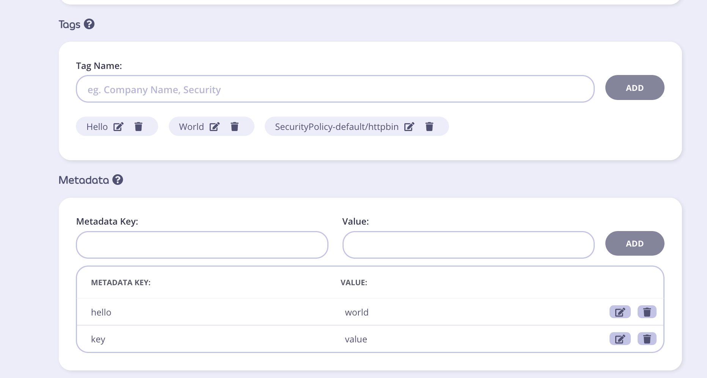

## Meta Data & Tags

This example deploys both an API and a Policy which protects that API.

The Policy has metadata and tags applied through the CRD.

## 1. Deploy a protected API and the policy which protects it.

```curl
$ kubectl apply -f metadata_tags.yaml
apidefinition.tyk.tyk.io/httpbin created
securitypolicy.tyk.tyk.io/httpbin created
```

Here's the section we care about in the SecurityPolicy yaml:
```
  tags:
    - Hello
    - World

  meta_data:
    key: value
    hello: world
```

This injects two tags, `Hello` and `World`, as well as the following K:V pairs in meta data:

-  `key:value`
-  `hello:world`

## 2. Done!

We created a policy which has tags and meta data!



Note: Ignore the `SecurityPolicy-default/httpbin` tag, that is automatically added by the operator and required.

## cleanup
Delete both the policy & httpbin CRDs:
```
$ kubectl delete tykpolicies httpbin;kubectl delete tykapis httpbin
```