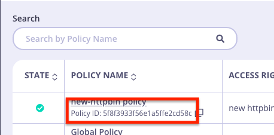

## Migration

If you have existing pre-Operator policies, you can easily link them to a CRD, which will allow you to modify them through the YAML moving forward.

Simply set the `id` field in the SecurityPolicy YAML to the `_id` field in the existing Policy's JSON.
This will allow the Operator to make the link.  

Note that the YAML becomes the source of truth and will overwrite any changes between it and the existing Policy.

#### Example

1. You have an existing Policy



2. Stick the policy ID `5f8f3933f56e1a5ffe2cd58c` into the YAML's `spec.id` field like below

`my-security-policy.yaml`:
```yaml
apiVersion: tyk.tyk.io/v1alpha1
kind: SecurityPolicy
metadata:
  name: new-httpbin-policy
spec:
  id: 5f8f3933f56e1a5ffe2cd58c
  name: My New HttpBin Policy
  state: active
  active: true
  access_rights_array:
    - name: new-httpbin-api # name of your ApiDefinition object.
      namespace: default    # namespace of your ApiDefinition object.
      versions:
        - Default
```

The `spec.access_rights_array` field of the YAML must refer to the ApiDefinition object that the policy identified by the id will affect.

In order to find available ApiDefinition objects:
```bash
$ kubectl get tykapis -A
NAMESPACE   NAME               DOMAIN   LISTENPATH   PROXY.TARGETURL      ENABLED
default     new-httpbin-api             /httpbin     http://httpbin.org   true
```

3. And then apply this file:

```bash
$ kubectl apply -f my-security-policy.yaml
securitypolicy.tyk.tyk.io/new-httpbin-policy created
```

Now the changes in the YAML were applied to the existing Policy.  You can now manage this policy through the CRD moving forward.

Note, if this resource is unintentionally deleted, the Operator will recreate it with the same `id` field as above, allowing keys to continue to work as before the delete event.