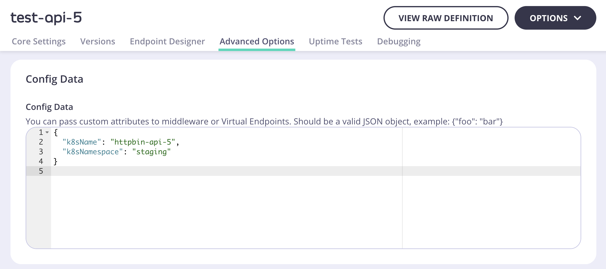

# Snapshot (WIP)

The snapshot package provides a CLI tool that allows dashboard users to export their 
existing Tyk APIs and Security Policies into CRD YAML format that can be used by Tyk Operator. 

It can help you to migrate existing APIs and Policies to Kubernetes environment.

> **Notes:** After the migration, please be reminded that you should stop using the Dashboard UI to manage the migrated APIs and Policies. Please see [Using Tyk Operator to enable GitOps with Tyk](https://tyk.io/docs/getting-started/key-concepts/gitops-with-tyk/) for more information.

This tool is provided as PoC only and bear some limitations and restrictions. Please use with caution.

| [Pre-requisite](#pre-requisite) | [Installation](#installation) | [Usage](#usage) | [Limitations](#limitations) |

## Pre-Requisite

1. Access to `tyk-operator` repository.
2. Credentials to connect Tyk Dashboard. Please visit [Tyk Docs](https://tyk.io/docs/tyk-stack/tyk-operator/installing-tyk-operator/#tyk-self-managed-hybrid)
for details.

## Installation

In order to use snapshot tool, you should have access to Tyk Operator repository
on your local machine.

1. Clone Tyk Operator repository
```bash
git clone https://github.com/TykTechnologies/tyk-operator.git
cd tyk-operator/
git checkout feat/importer-cli
```

2. Build Tyk Operator
```bash
go build
```

3. Run snapshot

- By default, snapshot only dumps ApiDefinitions grouped by a category. The category
can be configured through `--category` flag. The default category is `operator`.
For example, the command below only dumps ApiDefinitions within `k8s` category.
```bash
TYK_MODE=pro TYK_URL=<TYK_URL> TYK_AUTH=<TYK_AUTH> TYK_ORG=<TYK_ORG> ./tyk-operator --snapshot output.yaml --category k8s
```

- To dump all of your ApiDefinitions, you can pass the `--all` flag.
For example, the command below dumps all ApiDefinitions.
```bash
TYK_MODE=pro TYK_URL=<TYK_URL> TYK_AUTH=<TYK_AUTH> TYK_ORG=<TYK_ORG> ./tyk-operator --snapshot output.yaml --all
```

## Usage

```bash
Usage of ./tyk-operator:
  -all
    	Dump all APIs
  -category string
    	Dump APIs from specified category. (default "operator")
  -policy string
    	By passing an export flag, we are telling the Operator to connect to a Tyk installation 
    in order to pull a snapshot of SecurityPolicies from that environment and output as CR
  -snapshot string
    	By passing an export flag, we are telling the Operator to connect to a Tyk installation 
    in order to pull a snapshot of ApiDefinitions from that environment and output as CR
```

```bash
TYK_MODE=pro TYK_URL=<TYK_URL> TYK_AUTH=<TYK_AUTH> TYK_ORG=<TYK_ORG> ./tyk-operator --snapshot output.yaml --all
```

where

- `<TYK_URL>`: Management URL of your Tyk Dashboard.
- `<TYK_AUTH>`: Operator user API Key.
- `<TYK_ORG>`: Operator user ORG ID.

> For more details, please visit [Tyk Docs](https://tyk.io/docs/tyk-stack/tyk-operator/installing-tyk-operator/#tyk-self-managed-hybrid).

### Exporting ApiDefinitions

You can export all ApiDefinitions or particular ApiDefinitions specified via category.
Exported ApiDefinitions will be stored in the output file specified by `--snapshot`
flag.

- By default, tyk-operator exports ApiDefinitions defined in `#operator` category.
You can change default category via `-category` flag.
```bash
TYK_MODE=pro TYK_URL=<TYK_URL> TYK_AUTH=<TYK_AUTH> TYK_ORG=<TYK_ORG> ./tyk-operator --snapshot output.yaml --category k8s
```

- To dump all ApiDefinitions from Dashboard, you can specify `--all` flag, as follows:
```bash
TYK_MODE=pro TYK_URL=<TYK_URL> TYK_AUTH=<TYK_AUTH> TYK_ORG=<TYK_ORG> ./tyk-operator --snapshot output.yaml --all
```

#### Output CR

snapshot CLI creates an output file specified via `--snapshot` flag. Each ApiDefinition
CR metadata have a default name as `replace-me-{i}` where `{i}` increases by each 
ApiDefinition.

For example,
```yaml
apiVersion: tyk.tyk.io/v1alpha1
kind: ApiDefinition
metadata:
  name: replace-me-0 # Default name for ApiDefinition CRs
  namespace: default # Default namespace for ApiDefinition CRs
spec:
  ...
```

In order to specify CR metadata, you can use Config Data. For specified ApiDefinitions,
snapshot CLI generates ApiDefinition CRs based on Config Data of that specific ApiDefinition.
```json
{
  "k8sName": "metadata-name",
  "k8sNs": "metadata-namespace"
}
```

The CLI checks for `k8sName` and `k8sNs` fields of each ApiDefinition's Config Data 
to generate metadata of the output CR. If these fields exist, the CLI uses the 
values specified in these fields. Otherwise, it uses default values (`replace-me-` 
for name and `default` for namespace) for them.

Assume we have the following ApiDefinitions, two of which are categorized as `#testing` 
and created on our Dashboard.


If we would like to specify metadata of the `test-api-5`, we can update Config Data
of the ApiDefinition, as follows.



So, the generated output for this environment will look as follows;
```bash
TYK_MODE=pro TYK_URL=<TYK_URL> TYK_AUTH=<TYK_AUTH> TYK_ORG=<TYK_ORG> ./tyk-operator --snapshot output.yaml --category testing
```
```yaml
# output.yaml

apiVersion: tyk.tyk.io/v1alpha1
kind: ApiDefinition
metadata:
  creationTimestamp: null
  name: httpbin-api-5   # obtained from Config Data's "k8sName" field.
  namespace: staging    # obtained from Config Data's "k8sNs" field. 
spec:
  name: 'test-api-5 #testing'
  ...
---
apiVersion: tyk.tyk.io/v1alpha1
kind: ApiDefinition
metadata:
  creationTimestamp: null
  name: replace-me-1    # Since Config Data does not include "k8sName", default name is used.
  namespace: default    # Since Config Data does not include "k8sKey", default namespace is used.
spec:
  name: 'test-api-3 #testing'
  ...
```


### Exporting Security Policies

You can export your SecurityPolicy objects by specifying `--policy` flag.
```bash
TYK_MODE=pro TYK_URL=<TYK_URL> TYK_AUTH=<TYK_AUTH> TYK_ORG=<TYK_ORG> ./tyk-operator --snapshot output.yaml --policy policies.yaml
```
SecurityPolicy CRs will be saved into a file specified in `--policy` command.

_**Warning:**_ All ApiDefinitions that SecurityPolicy access must exist in Kubernetes.
Otherwise, SecurityPolicy controller logs an error since it cannot find corresponding
ApiDefinition resource on the environment.

## Limitations
- Not all features are supported by Operator. Hence, some configurations would be
_lost_ during the conversion. 

> Please visit [ApiDefinition](https://github.com/TykTechnologies/tyk-operator/blob/master/docs/api_definitions.md)
and [Policies](https://github.com/TykTechnologies/tyk-operator/blob/master/docs/policies.md)
documentations to see supported features.

- Please remember that this is a PoC for exporting ApiDefinitions to k8s resources. 
First, try on your testing environment.
